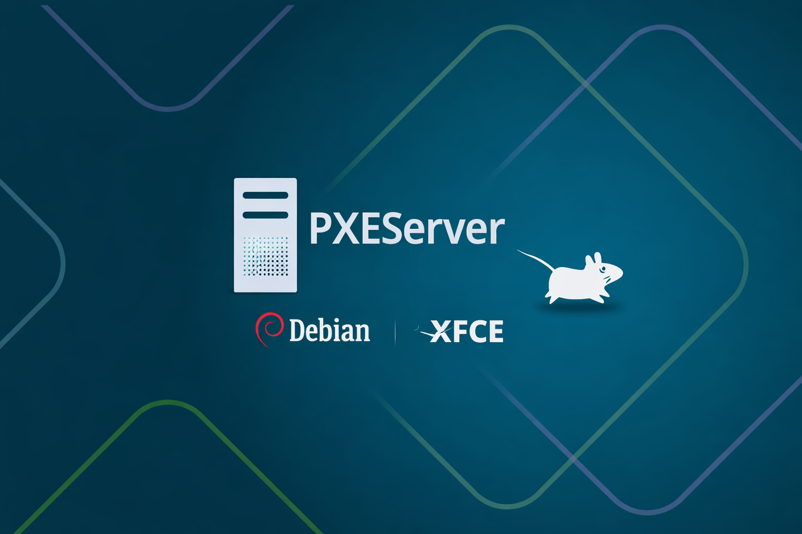
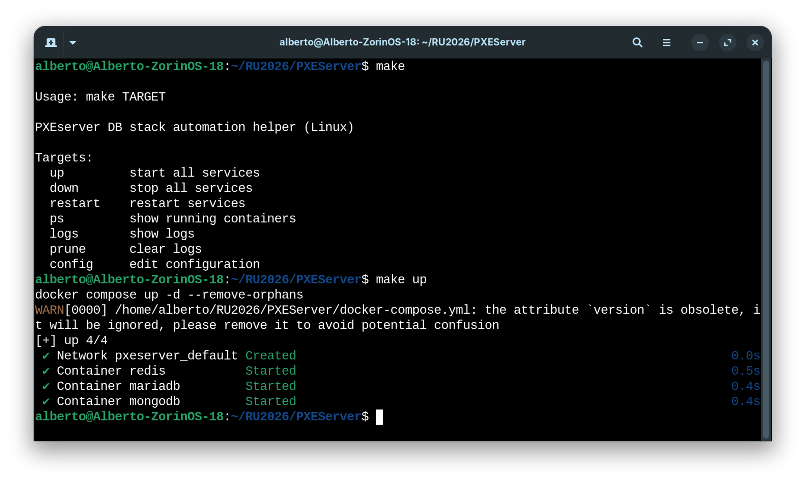
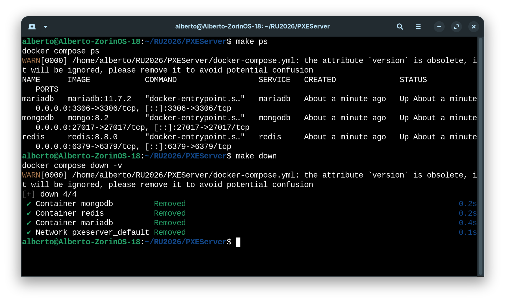
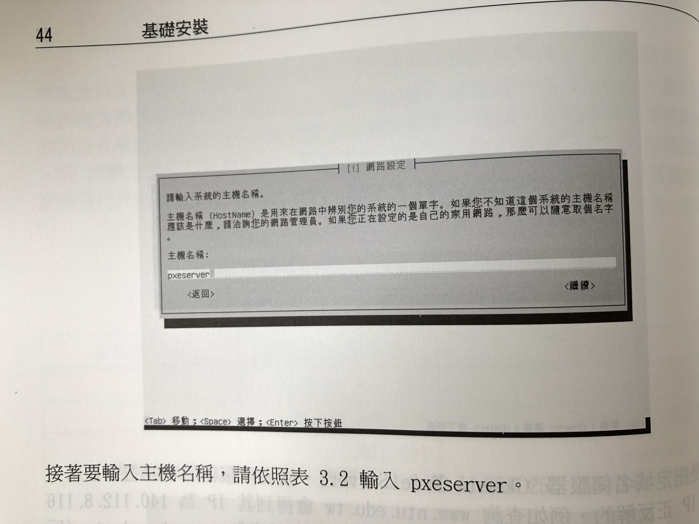

### PXEServer: Database Stack on Debian 13 with Docker

> "There is no sure prize for virtue, and no sure punishment for sin. Nor would it be right for such prizes and punishments to exist."<br /><br />"Nenhum prémio certo tem a virtude, nenhum castigo certo o pecado. Nem seria justo que houvesse tal prémio ou tal castigo."<br/>--- The Book of Disquiet by Fernando Pessoa




#### Prologue 
This project sets up **Redis, MariaDB, and MongoDB** inside a Debian 13 VM (with XFCE) running on VirtualBox.  The databases are managed via **Docker Compose** and a **Makefile** for lifecycle automation.  


#### I. Project Structure
```
├── .env
├── docker-compose.yml
├── Makefile
├── conf/
│   └── redis/
│       └── redis.conf
└── data/
    ├── redis/
    ├── mariadb/
    └── mongodb/
```


#### II. `.env` file
```
REDIS_IMAGE=redis:8.8.0
MARIADB_IMAGE=mariadb:11.7.2
MONGODB_IMAGE=mongo:8.2

DATA_DIR=./data
CONFIG_DIR=./conf
```


#### III. `docker-compose.yml`
```
version: "3.8"

services:
  redis:
    image: ${REDIS_IMAGE}
    container_name: redis
    ports:
      - "6379:6379"
    command: ["redis-server", "/conf/redis.conf"]
    volumes:
      - ${CONFIG_DIR}/redis:/conf:ro
      - ${DATA_DIR}/redis:/data:rw
    restart: unless-stopped

  mariadb:
    image: ${MARIADB_IMAGE}
    container_name: mariadb
    environment:
      MYSQL_ROOT_PASSWORD: 7aStgp6OCwAHTNXBp1MGRxh0XgXFjoFcQZDSeVG5KKs=   # change this!
      MYSQL_DATABASE: mydb
      MYSQL_USER: myuser
      MYSQL_PASSWORD: mypassword
    ports:
      - "3306:3306"
    volumes:
      - ${DATA_DIR}/mariadb:/var/lib/mysql:rw
    restart: unless-stopped

  mongodb:
    image: ${MONGODB_IMAGE}
    container_name: mongodb
    ports:
      - "27017:27017"
    volumes:
      - ${DATA_DIR}/mongodb:/data/db:rw
    restart: unless-stopped
```


#### IV. `Makefile`
```
cnf ?= .env
include $(cnf)
export $(shell sed 's/=.*//' $(cnf))

COMPOSE = docker compose

.PHONY: help up down restart ps logs prune config

help:
	@echo
	@echo "Usage: make TARGET"
	@echo
	@echo "PXEserver DB stack automation helper (Linux)"
	@echo
	@echo "Targets:"
	@echo "  up         start all services"
	@echo "  down       stop all services"
	@echo "  restart    restart services"
	@echo "  ps         show running containers"
	@echo "  logs       show logs"
	@echo "  prune      clear logs"
	@echo "  config     edit configuration"

up:
	$(COMPOSE) up -d --remove-orphans

down:
	$(COMPOSE) down -v

restart:
	$(COMPOSE) restart

ps:
	$(COMPOSE) ps

logs:
	$(COMPOSE) logs -f

prune:
	@echo "Clearing logs..."
	@rm -f $(DATA_DIR)/redis/*.log || true
	@rm -f $(DATA_DIR)/mariadb/*.log || true
	@rm -f $(DATA_DIR)/mongodb/*.log || true

config:
	nano .env
```

#### V. Let’s get started!
Step 1: [Install Docker on Debian 13](https://docs.docker.com/engine/install/debian/)

Set up Docker's `apt` repository.
```
# Add Docker's official GPG key:
sudo apt update
sudo apt install ca-certificates curl
sudo install -m 0755 -d /etc/apt/keyrings
sudo curl -fsSL https://download.docker.com/linux/debian/gpg -o /etc/apt/keyrings/docker.asc
sudo chmod a+r /etc/apt/keyrings/docker.asc

# Add the repository to Apt sources:
sudo tee /etc/apt/sources.list.d/docker.sources <<EOF
Types: deb
URIs: https://download.docker.com/linux/debian
Suites: $(. /etc/os-release && echo "$VERSION_CODENAME")
Components: stable
Architectures: $(dpkg --print-architecture)
Signed-By: /etc/apt/keyrings/docker.asc
EOF

sudo apt update
```

Install the Docker packages.
```
sudo apt install docker-ce docker-ce-cli containerd.io docker-buildx-plugin docker-compose-plugin
```

Verify that Docker is running:
```
sudo systemctl status docker
```

Verify installation:
```
docker --version
docker compose version
```

Verify that the installation is successful by running the `hello-world` image:
```
sudo docker run hello-world
```

Step 2: Open Ports for External Access

1. **VirtualBox Networking**
   - Use **Bridged Adapter** (recommended) so the VM appears as a device on your LAN.  
   - Or use **NAT + Port Forwarding** to map host ports to VM ports.

2. **Firewall (UFW)**
```
sudo ufw allow 6379/tcp   # Redis
sudo ufw allow 3306/tcp   # MariaDB
sudo ufw allow 27017/tcp  # MongoDB
sudo ufw reload
```

3. **Verify listening ports**
```
sudo ss -tlnp | grep -E '6379|3306|27017'
```

Step 3: Access by Hostname (`pxeserver`)
```
sudo nano /etc/hosts
```

Add:
```
192.168.1.50   pxeserver
```

*(Replace with your VM’s IP — check with `ip addr` inside Debian.)*

Step 4: Run the Stack

1. Clone the repository: 
```
git clone https://github.com/Albert0i/PXEServer.git

cd PXEServer
```

2. Create `.env` and directories: 
```
cp dotenv .env 

mkdir -p data/{redis,mariadb,mongodb}
```

3. Start services:
```
make up
```



4. Check status:
```bash
make ps
```


5. View logs:
```
make logs
```

Step 5: User Group Setup (`alberto`)
```
sudo usermod -aG docker alberto
```

Log out and back in (or reboot). 

Step 6: Automatic Restart of Databases

- Enable Docker service:
```
sudo systemctl enable docker
```

- Containers use `restart: unless-stopped`, ensuring:
  - They restart after reboot.  
  - They restart if they crash.  
  - They stay down only if you stop them manually.

Verify after reboot:
```
docker ps
```

Step 7: Enable MongoDB Authentication (Optional)

By default, the MongoDB container runs **without authentication**. This is fine for local testing, but for production‑like use you should enable a username and password.

Option A: Default (no authentication) With the current `docker-compose.yml`:
```
mongodb:
  image: ${MONGODB_IMAGE}
  container_name: mongodb
  ports:
    - "27017:27017"
  volumes:
    - ${DATA_DIR}/mongodb:/data/db:rw
  restart: unless-stopped
```

You can connect directly:
```
mongosh --host pxeserver --port 27017
```

No credentials are required.

Option B: Secure (authentication enabled)

Add environment variables to the MongoDB service:

```
mongodb:
  image: ${MONGODB_IMAGE}
  container_name: mongodb
  ports:
    - "27017:27017"
  environment:
    MONGO_INITDB_ROOT_USERNAME: root
    MONGO_INITDB_ROOT_PASSWORD: yourStrongPassword
  volumes:
    - ${DATA_DIR}/mongodb:/data/db:rw
  restart: unless-stopped
```

This creates a root user with the specified password. Connect using:

```
mongosh --host pxeserver --port 27017 -u root -p yourStrongPassword --authenticationDatabase admin
```

Step 8: Enable Redis Authentication and Database Location

By default, Redis runs without a password. For secure setups, you should configure authentication and persistence in `redis.conf`.

**Sample `redis.conf`**

```
# Redis configuration file

# Require clients to authenticate with a password
requirepass myStrongRedisPassword

# Optional: enable ACL user with username/password (Redis 6+)
# user default on >myStrongRedisPassword ~* +@all

# Set the working directory for database files
dir /data

# Name of the dump file (RDB persistence)
dbfilename dump.rdb

# Append-only file for durability
appendonly yes
appendfilename "appendonly.aof"
```

- `requirepass myStrongRedisPassword` sets the password clients must use.  
  Connect with:
  ```bash
  redis-cli -h pxeserver -p 6379 -a myStrongRedisPassword
  ```
- `dir /data` → tells Redis to store its persistence files in `/data`.  
  In your `docker-compose.yml`, `/data` is mapped to `./data/redis` on the host.  
- `dbfilename dump.rdb` → snapshot file name.  
- `appendonly yes` → enables append‑only file persistence for durability.  

Your Compose file mounts:
```yaml
volumes:
  - ${CONFIG_DIR}/redis:/conf:ro
  - ${DATA_DIR}/redis:/data:rw
```

So place the `redis.conf` under:
```
./conf/redis/redis.conf
```

Redis will read it at startup, and persistence files (`dump.rdb`, `appendonly.aof`) will be written into:
```
./data/redis/
```

**Notes**

- Change passwords in `.env` before production use.  
- Use VM snapshots for rollback safety.  
- Bridged networking is easiest for multi‑device access.  
- NAT + Port Forwarding works if you only need host access.  
- Add `alberto` to the docker group for convenience.  
- Containers auto‑start after reboot thanks to `restart: unless-stopped`.


#### VI. Conclusion
This setup ensures:
- PXEserver runs **three databases (Redis, MariaDB, MongoDB)** continuously until shutdown.  
- After reboot or updates, services **resume automatically**.  
- Data is safely stored in dedicated subfolders under `./data`.  
- You can connect by hostname (`pxeserver`) instead of IP.  
- Lifecycle management is simplified with the provided `Makefile`.  
- User `alberto` can manage Docker without `sudo`.  


#### VII. Bibliography 
1. [64位元Debian Linux作業系統實務-Trixie版, 李博明編著](https://eshop.tsanghai.com.tw/products/cs0464)
2. [Install Docker Engine on Debian](https://docs.docker.com/engine/install/debian/)
3. [The Book of Disquiet by Fernando Pessoa](https://dn720004.ca.archive.org/0/items/english-collections-1/Book%20of%20Disquiet%2C%20The%20-%20Fernando%20Pessoa.pdf)


#### Epilogue 
Everything has a reason, right? Why "PXE Server" and what does "PXE" stand for?

> "To see all the things that happen to us as accidents or incidents from
a novel, which we read not with our eyes but with life. Only with
this attitude can we overcome the mischief of each day and the
fickleness of events."

> "Considerar todas as coisas que nos sucedem’ como acidentes ou episódios de um romance, a que assistimos não com a atenção senão com a vida. Só com essa atitude poderemos vencer a malícia dos dias e os caprichos dos sucessos."




### EOF (2026/07/10)

